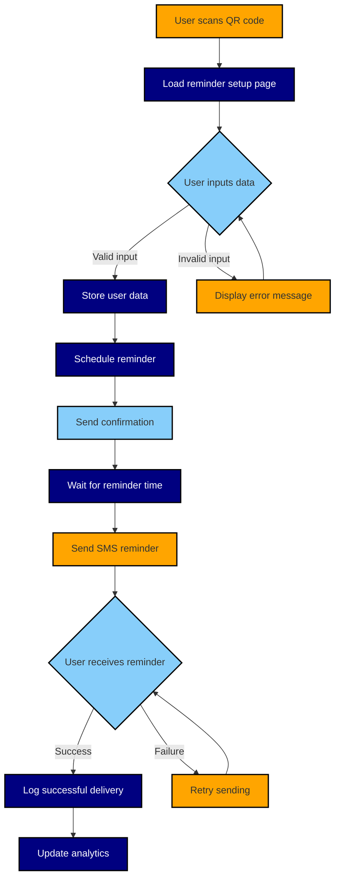
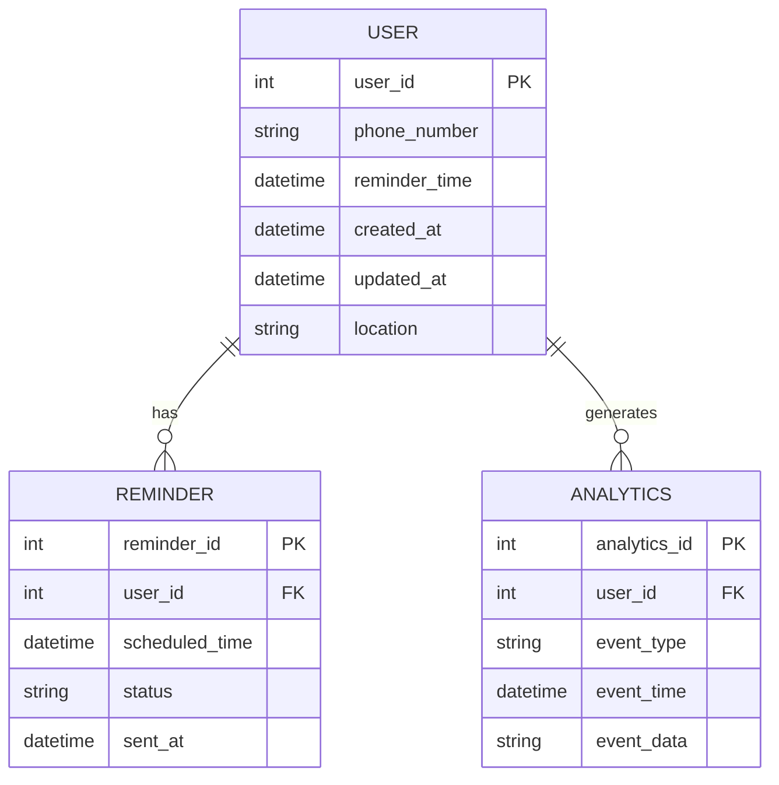
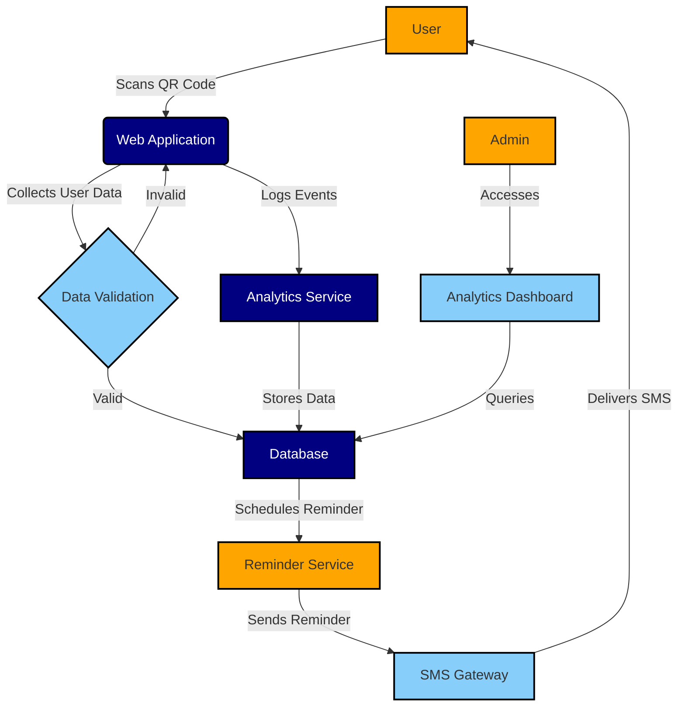

# 1. INTRODUCTION

## 1.1 PURPOSE

The purpose of this Software Requirements Specification (SRS) document is to provide a comprehensive description of the supplement reminder website. It outlines the functional and non-functional requirements, system constraints, and design specifications for the development team, project stakeholders, and quality assurance personnel. This document serves as a foundation for the project, ensuring all parties have a clear understanding of the website's objectives and features.

## 1.2 SCOPE

The supplement reminder website is a web-based application designed to help consumers remember to take their supplements by sending timely text message reminders. The primary goals of this product are:

1. To increase supplement adherence among users aged 21-35, with a focus on women.
2. To provide a simple, user-friendly interface for setting up reminders.
3. To deliver reliable and timely text message reminders to users.

Key benefits of the system include:

- Improved supplement effectiveness through consistent usage
- Enhanced user experience with easy setup via QR code
- Potential for increased customer satisfaction and loyalty

Core functionalities of the website include:

1. QR code-based access to the reminder setup page
2. User input form for phone number and reminder time
3. Automated text message reminders at specified times
4. Secure storage of user data
5. Basic analytics for user engagement and location tracking

The website will be developed with a responsive design, optimized for mobile devices, and integrate with a third-party SMS service for sending reminders. The project aims to launch within a 5-month timeframe, following a phased development approach to ensure a robust and user-friendly final product.

## 2. PRODUCT DESCRIPTION

### 2.1 PRODUCT PERSPECTIVE

The supplement reminder website is a standalone web application designed to integrate seamlessly with existing supplement product packaging through QR code technology. It operates within the broader ecosystem of health and wellness products, serving as a digital companion to physical supplements. The system interacts with users' mobile devices for QR code scanning and receives input, while also interfacing with a third-party SMS service to deliver reminders.

Key interfaces include:

1. User Interface: A responsive web interface optimized for mobile devices.
2. SMS Service Interface: Integration with a third-party SMS provider (e.g., Twilio or SendGrid) for sending text message reminders.
3. Database Interface: Secure storage of user data, including phone numbers and reminder times.
4. Analytics Interface: Basic integration with an analytics tool (e.g., Google Analytics) for tracking user engagement and behavior.

### 2.2 PRODUCT FUNCTIONS

The supplement reminder website will perform the following main functions:

1. QR Code Redirection: Direct users to the reminder setup page when scanning the QR code on product packaging.
2. User Data Collection: Capture and validate user phone numbers and preferred reminder times through a simple web form.
3. Reminder Scheduling: Set up automated text message reminders based on user-specified times.
4. Text Message Delivery: Send personalized reminder messages to users at scheduled times.
5. Data Storage: Securely store and manage user information and reminder preferences.
6. Basic Analytics: Track user engagement, including sign-up rates and general location data.
7. User Confirmation: Provide immediate feedback to users upon successful reminder setup.

### 2.3 USER CHARACTERISTICS

The primary target audience for the supplement reminder website consists of individuals aged 21-35, with a particular focus on women. User personas include:

1. Busy Professional:
   - Age: 28-35
   - Tech-savvy, but time-constrained
   - Values convenience and efficiency
   - Likely to use the reminder service to maintain health routines amidst a hectic schedule

2. Health-Conscious Millennial:
   - Age: 21-27
   - Highly engaged with health and wellness trends
   - Comfortable with mobile technology and QR codes
   - Appreciates personalized health solutions

3. New Supplement User:
   - Age: 21-35
   - Limited experience with supplement routines
   - May need additional guidance and reminders
   - Likely to value the reminder service as a supportive tool

Users are expected to have basic familiarity with smartphone usage, QR code scanning, and web form interactions. No specialized technical knowledge is required to use the service.

### 2.4 CONSTRAINTS

The development and operation of the supplement reminder website are subject to the following constraints:

1. Regulatory Compliance:
   - Must adhere to data privacy regulations such as GDPR and other relevant local laws
   - Compliance with health information protection standards may be necessary

2. Technical Limitations:
   - Reliance on third-party SMS services for reminder delivery
   - Dependence on user's mobile device capabilities for QR code scanning
   - Limited to text-based reminders; no multimedia messaging support

3. Time Constraints:
   - Development and launch must be completed within a 5-month timeframe

4. Budget Constraints:
   - Development costs must align with allocated budget (specific figures not provided)
   - Ongoing operational costs for SMS services and web hosting must be considered

5. User Interface Constraints:
   - Design must adhere to specified color scheme (orange, navy blue, and baby blue)
   - Interface must be simple and intuitive for quick user interaction

6. Performance Constraints:
   - Website must load quickly on mobile devices
   - System must handle potential spikes in user registrations during product launches or promotions

### 2.5 ASSUMPTIONS AND DEPENDENCIES

The following assumptions and dependencies are considered for the successful implementation of the supplement reminder website:

Assumptions:
1. Users have access to smartphones capable of scanning QR codes and browsing websites.
2. The target audience is comfortable with providing phone numbers for text message reminders.
3. The supplement packaging will have adequate space and print quality for QR code inclusion.
4. Users will have consistent access to cellular networks or internet for receiving text messages.

Dependencies:
1. Reliability and uptime of the chosen third-party SMS service provider.
2. Availability and performance of the web hosting service.
3. Timely delivery of product packaging with correct QR codes from the manufacturing process.
4. Continued support and updates for the chosen web development frameworks and libraries.
5. Stability of mobile operating systems and their QR code scanning capabilities.
6. Compliance of third-party services (SMS, analytics) with relevant data protection regulations.

Here's the PROCESS FLOWCHART section of the SRS using Mermaid JS, maintaining consistency with the previous technology and framework choices in the document:

## 3. PROCESS FLOWCHART

The following flowchart illustrates the main process flow of the supplement reminder website:

This flowchart represents the main process flow of the supplement reminder website, from the user scanning the QR code to receiving the reminder and updating analytics. The color scheme used in the flowchart (orange, navy blue, and baby blue) aligns with the specified design requirements.

Key steps in the process:

1. User scans the QR code on the product packaging.
2. The reminder setup page loads on the user's device.
3. User inputs their phone number and preferred reminder time.
4. The system validates the input and stores the user data.
5. A reminder is scheduled based on the user's preferences.
6. A confirmation message is sent to the user.
7. The system waits until the specified reminder time.
8. An SMS reminder is sent using the integrated third-party SMS service.
9. The system logs the delivery status and updates analytics.

This flowchart provides a visual representation of the core functionality described in the previous sections, ensuring consistency with the outlined features and user flow.

## 4. FUNCTIONAL REQUIREMENTS

### 4.1 QR Code Redirection

#### ID
FR-001

#### DESCRIPTION
The system shall redirect users to the reminder setup page when they scan the QR code printed on the product packaging.

#### PRIORITY
High

#### TABLE OF FUNCTIONAL REQUIREMENTS

| Requirement ID | Requirement Description |
|----------------|--------------------------|
| FR-001-1 | The system shall generate a unique URL for the reminder setup page. |
| FR-001-2 | The system shall encode the URL into a QR code format compatible with standard mobile device scanners. |
| FR-001-3 | The system shall ensure the QR code redirects to the correct reminder setup page when scanned. |
| FR-001-4 | The system shall support deep linking to open the reminder setup page directly in mobile browsers. |

### 4.2 User Data Collection

#### ID
FR-002

#### DESCRIPTION
The system shall provide a web form to collect user phone numbers and preferred reminder times.

#### PRIORITY
High

#### TABLE OF FUNCTIONAL REQUIREMENTS

| Requirement ID | Requirement Description |
|----------------|--------------------------|
| FR-002-1 | The system shall provide an input field for users to enter their phone number. |
| FR-002-2 | The system shall provide a time selection input for users to choose their preferred reminder time. |
| FR-002-3 | The system shall set the default reminder time to 12:00 AM. |
| FR-002-4 | The system shall validate the phone number format and display an error message for incorrect entries. |
| FR-002-5 | The system shall allow users to adjust the reminder time as needed. |

### 4.3 Reminder Scheduling

#### ID
FR-003

#### DESCRIPTION
The system shall schedule automated text message reminders based on user-specified times.

#### PRIORITY
High

#### TABLE OF FUNCTIONAL REQUIREMENTS

| Requirement ID | Requirement Description |
|----------------|--------------------------|
| FR-003-1 | The system shall create a reminder schedule based on the user's input. |
| FR-003-2 | The system shall integrate with a third-party SMS service (e.g., Twilio or SendGrid) to send reminders. |
| FR-003-3 | The system shall ensure reminders are sent at the exact time specified by the user. |
| FR-003-4 | The system shall handle time zone differences to ensure accurate reminder delivery. |

### 4.4 Text Message Delivery

#### ID
FR-004

#### DESCRIPTION
The system shall send personalized reminder messages to users at scheduled times.

#### PRIORITY
High

#### TABLE OF FUNCTIONAL REQUIREMENTS

| Requirement ID | Requirement Description |
|----------------|--------------------------|
| FR-004-1 | The system shall send the message "Bon voyage! Take the supplement so you feel better tomorrow!" as the reminder text. |
| FR-004-2 | The system shall log the delivery status of each sent message. |
| FR-004-3 | The system shall implement a retry mechanism for failed message deliveries. |
| FR-004-4 | The system shall ensure compliance with SMS regulations and best practices. |

### 4.5 Data Storage

#### ID
FR-005

#### DESCRIPTION
The system shall securely store and manage user information and reminder preferences.

#### PRIORITY
High

#### TABLE OF FUNCTIONAL REQUIREMENTS

| Requirement ID | Requirement Description |
|----------------|--------------------------|
| FR-005-1 | The system shall store user phone numbers in an encrypted format. |
| FR-005-2 | The system shall store selected reminder times for each user. |
| FR-005-3 | The system shall record timestamps of when users input their data. |
| FR-005-4 | The system shall implement secure database access controls. |
| FR-005-5 | The system shall ensure data storage complies with relevant privacy regulations (e.g., GDPR). |

### 4.6 Basic Analytics

#### ID
FR-006

#### DESCRIPTION
The system shall track user engagement and general location data.

#### PRIORITY
Medium

#### TABLE OF FUNCTIONAL REQUIREMENTS

| Requirement ID | Requirement Description |
|----------------|--------------------------|
| FR-006-1 | The system shall integrate with a basic analytics tool (e.g., Google Analytics). |
| FR-006-2 | The system shall track the number of QR code scans and form submissions. |
| FR-006-3 | The system shall record general location data (e.g., city) based on user input, if possible without violating privacy norms. |
| FR-006-4 | The system shall generate reports on user engagement and reminder effectiveness. |

### 4.7 User Confirmation

#### ID
FR-007

#### DESCRIPTION
The system shall provide immediate feedback to users upon successful reminder setup.

#### PRIORITY
Medium

#### TABLE OF FUNCTIONAL REQUIREMENTS

| Requirement ID | Requirement Description |
|----------------|--------------------------|
| FR-007-1 | The system shall display a confirmation message after successful form submission. |
| FR-007-2 | The system shall send a confirmation text message to the user's phone number. |
| FR-007-3 | The system shall provide clear instructions on what to expect next. |
| FR-007-4 | The system shall offer an option to modify or cancel the reminder setup. |

## 5. NON-FUNCTIONAL REQUIREMENTS

### 5.1 PERFORMANCE

| ID | Requirement |
|----|-------------|
| NFR-001 | The website shall load within 2 seconds on desktop and 3 seconds on mobile devices with 3G connections. |
| NFR-002 | The system shall handle at least 1000 concurrent users without degradation in performance. |
| NFR-003 | The SMS reminder service shall deliver 99% of messages within 60 seconds of the scheduled time. |
| NFR-004 | Database queries shall return results in less than 100 milliseconds for 95% of requests. |
| NFR-005 | The system shall consume no more than 2GB of RAM under normal operating conditions. |

### 5.2 SAFETY

| ID | Requirement |
|----|-------------|
| NFR-006 | The system shall implement daily automated backups of all user data. |
| NFR-007 | In case of system failure, the website shall display a user-friendly error message with appropriate contact information. |
| NFR-008 | The system shall log all critical errors and send automated alerts to the development team. |
| NFR-009 | The system shall implement rate limiting to prevent abuse of the SMS service. |
| NFR-010 | User data shall be stored in geographically distributed data centers to ensure data availability in case of localized failures. |

### 5.3 SECURITY

| ID | Requirement |
|----|-------------|
| NFR-011 | All data transmission between the client and server shall be encrypted using TLS 1.3 or higher. |
| NFR-012 | User phone numbers shall be encrypted at rest using AES-256 encryption. |
| NFR-013 | The system shall implement input validation and sanitization to prevent SQL injection and XSS attacks. |
| NFR-014 | The system shall use secure HTTP headers, including Content Security Policy and X-XSS-Protection. |
| NFR-015 | Access to the database and SMS service shall be restricted to authorized personnel only, using role-based access control. |
| NFR-016 | The system shall implement CAPTCHA or similar mechanisms to prevent automated form submissions. |

### 5.4 QUALITY

| ID | Requirement |
|----|-------------|
| NFR-017 | The website shall maintain 99.9% uptime, excluding scheduled maintenance periods. |
| NFR-018 | The system shall be designed with a modular architecture to facilitate easy maintenance and updates. |
| NFR-019 | The user interface shall follow responsive design principles, ensuring usability across devices with screen sizes from 320px to 1920px wide. |
| NFR-020 | The system shall be scalable to handle a 200% increase in user base without significant code changes. |
| NFR-021 | The system shall have a Mean Time Between Failures (MTBF) of at least 720 hours. |
| NFR-022 | The user interface shall be designed to require no more than 3 clicks to complete the reminder setup process. |

### 5.5 COMPLIANCE

| ID | Requirement |
|----|-------------|
| NFR-023 | The system shall comply with the General Data Protection Regulation (GDPR) for handling European user data. |
| NFR-024 | The system shall adhere to the California Consumer Privacy Act (CCPA) for California residents. |
| NFR-025 | The SMS reminders shall comply with the Telephone Consumer Protection Act (TCPA) regulations. |
| NFR-026 | The website shall meet WCAG 2.1 Level AA accessibility standards. |
| NFR-027 | The system shall comply with PCI DSS requirements if any payment information is processed. |
| NFR-028 | The privacy policy and terms of service shall be clearly accessible on the website and updated as necessary to reflect current data handling practices. |

These non-functional requirements are designed to ensure the supplement reminder website meets high standards of performance, safety, security, quality, and compliance. They align with the previously mentioned technology choices and framework considerations, such as the use of responsive design, integration with third-party SMS services, and the focus on mobile optimization. The requirements also address the specific needs of the target audience (ages 21-35, with a focus on women) by emphasizing usability, quick loading times on mobile devices, and strict data protection measures.

## 6. DATA REQUIREMENTS

### 6.1 DATA MODELS

The following entity-relationship diagram illustrates the data model for the supplement reminder website:

This data model represents the core entities and their relationships in the supplement reminder system:

1. USER: Stores essential user information.
2. REMINDER: Tracks individual reminders scheduled for users.
3. ANALYTICS: Captures user engagement and system events for analysis.

### 6.2 DATA STORAGE

#### 6.2.1 Database Selection
The system will use a relational database management system (RDBMS) such as PostgreSQL for primary data storage. This choice aligns with the need for data integrity, complex querying capabilities, and support for transactions.

#### 6.2.2 Data Retention
- User data will be retained for the duration of service usage plus an additional 6 months after the last activity.
- Reminder data will be kept for 3 months after the scheduled reminder time for auditing purposes.
- Analytics data will be stored for 12 months to allow for long-term trend analysis.

#### 6.2.3 Data Redundancy and Backup
- The database will be configured with real-time replication to a secondary server to ensure high availability.
- Full database backups will be performed daily and stored in a secure, off-site location.
- Incremental backups will be taken every 6 hours to minimize data loss in case of system failure.

#### 6.2.4 Data Recovery
- A comprehensive disaster recovery plan will be implemented, including:
  - Automated failover to the secondary database in case of primary database failure.
  - Regular testing of backup restoration processes to ensure data integrity.
  - A target Recovery Time Objective (RTO) of 1 hour and Recovery Point Objective (RPO) of 15 minutes.

#### 6.2.5 Scalability
- The database will be designed to handle a projected user base growth of 200% within the first year.
- Horizontal scaling through sharding will be implemented if the user base exceeds 1 million active users.
- Caching mechanisms (e.g., Redis) will be employed to reduce database load for frequently accessed data.

### 6.3 DATA PROCESSING

#### 6.3.1 Data Security
- All sensitive data, including phone numbers, will be encrypted at rest using AES-256 encryption.
- Data in transit will be protected using TLS 1.3 or higher.
- Access to the database will be restricted to authorized personnel only, using role-based access control.
- Regular security audits and penetration testing will be conducted to identify and address vulnerabilities.

#### 6.3.2 Data Flow

The following diagram illustrates the high-level data flow within the supplement reminder system:

This data flow diagram outlines the key processes in the supplement reminder system:

1. User interaction with the web application through QR code scanning.
2. Data collection and validation.
3. Storage of user data and reminder schedules.
4. Reminder processing and delivery through the SMS gateway.
5. Event logging and analytics data collection.
6. Administrative access to analytics dashboard.

#### 6.3.3 Data Processing Considerations
- Input sanitization and validation will be performed on all user-submitted data to prevent injection attacks.
- Asynchronous processing will be used for non-critical tasks such as analytics data collection to ensure optimal performance.
- Rate limiting will be implemented on the API to prevent abuse and ensure fair usage of system resources.
- Personally Identifiable Information (PII) will be pseudonymized or anonymized where possible, especially in analytics data processing.

This DATA REQUIREMENTS section aligns with the previously mentioned technology choices and framework considerations, such as the use of a relational database, integration with third-party SMS services, and the focus on data security and privacy. The data model and processing flow support the core functionalities outlined in earlier sections of the SRS, including user registration, reminder scheduling, and basic analytics tracking.

## 7. EXTERNAL INTERFACES

### 7.1 USER INTERFACES

The supplement reminder website will feature a simple, intuitive user interface optimized for mobile devices while remaining functional on desktop browsers. The interface will adhere to the specified color scheme of orange, navy blue, and baby blue.

#### 7.1.1 Main Landing Page

The main landing page will consist of the following elements:

1. A prominent header with the product logo and name
2. A brief welcome message explaining the purpose of the reminder service
3. A simple form for user input, including:
   - Phone number input field
   - Time selection for reminder (default set to 12:00 AM)
   - Submit button
4. A link to the FAQ section
5. Footer with privacy policy and terms of service links

#### 7.1.2 Confirmation Page

Upon successful submission of the form, users will be directed to a confirmation page containing:

1. A success message confirming the reminder has been set
2. A summary of the entered information (phone number and reminder time)
3. Instructions on what to expect next
4. An option to modify or cancel the reminder

#### 7.1.3 Error Handling

Error messages will be displayed inline with the form fields, using a distinct color (e.g., red) to draw attention. Common error scenarios include:

1. Invalid phone number format
2. Empty required fields
3. Server-side validation errors

#### 7.1.4 Responsive Design

The user interface will be responsive, adapting to various screen sizes:

- Mobile devices (320px - 480px)
- Tablets (481px - 768px)
- Desktops (769px and above)

#### 7.1.5 Accessibility

The interface will comply with WCAG 2.1 Level AA standards, ensuring accessibility for users with disabilities.

[Placeholder for UI mockups]

### 7.2 HARDWARE INTERFACES

As a web-based application, the supplement reminder website does not directly interface with specific hardware components. However, it is designed to function across a variety of devices and platforms:

1. Mobile devices (smartphones and tablets) running iOS, Android, or other mobile operating systems
2. Desktop and laptop computers running Windows, macOS, or Linux
3. Various web browsers, including but not limited to Chrome, Firefox, Safari, and Edge

The system will adapt to different screen sizes and resolutions through responsive design techniques.

### 7.3 SOFTWARE INTERFACES

The supplement reminder website will interface with the following software systems:

#### 7.3.1 Web Server

- Type: HTTP server (e.g., Nginx or Apache)
- Purpose: Host and serve the web application
- Data Exchanged: HTTP/HTTPS requests and responses

#### 7.3.2 Application Server

- Type: Node.js server with Express.js framework
- Purpose: Handle application logic and API requests
- Data Exchanged: JSON data for API requests and responses

#### 7.3.3 Database Management System

- Type: PostgreSQL
- Purpose: Store user data, reminder schedules, and analytics information
- Data Exchanged: SQL queries and results

#### 7.3.4 SMS Gateway Service

- Type: Third-party SMS service (e.g., Twilio or SendGrid)
- Purpose: Send text message reminders to users
- Data Exchanged: API calls to send SMS messages, delivery status reports

#### 7.3.5 Analytics Service

- Type: Google Analytics or similar web analytics platform
- Purpose: Track user engagement and website usage
- Data Exchanged: User interaction data, page views, and custom events

### 7.4 COMMUNICATION INTERFACES

The supplement reminder website will utilize the following communication interfaces:

#### 7.4.1 HTTP/HTTPS

- Protocol: HTTP/1.1, HTTP/2
- Purpose: Communication between client browsers and the web server
- Data Format: HTML, CSS, JavaScript, JSON
- Port: 80 (HTTP), 443 (HTTPS)
- Security: TLS 1.3 or higher for HTTPS connections

#### 7.4.2 Database Connection

- Protocol: PostgreSQL wire protocol
- Purpose: Communication between the application server and the database
- Data Format: SQL queries and result sets
- Port: 5432 (default PostgreSQL port)
- Security: SSL/TLS encryption for data in transit

#### 7.4.3 SMS Gateway API

- Protocol: HTTPS
- Purpose: Sending SMS reminders through the third-party service
- Data Format: JSON or XML, depending on the chosen service's API
- Authentication: API keys or OAuth 2.0
- Security: TLS 1.2 or higher

#### 7.4.4 Analytics API

- Protocol: HTTPS
- Purpose: Sending analytics data to the tracking service
- Data Format: JSON
- Authentication: API keys or OAuth 2.0
- Security: TLS 1.2 or higher

#### 7.4.5 WebSockets (Optional)

- Protocol: WSS (WebSocket Secure)
- Purpose: Real-time updates for admin dashboard (if implemented)
- Data Format: JSON
- Port: 443
- Security: TLS 1.2 or higher

All communication interfaces will implement appropriate error handling, retry mechanisms, and logging to ensure reliable operation and facilitate troubleshooting.

## APPENDICES

### A. GLOSSARY

| Term | Definition |
|------|------------|
| QR Code | Quick Response code, a type of matrix barcode that can be scanned by mobile devices to quickly access information or websites. |
| SMS | Short Message Service, a text messaging service component of most telephone, internet, and mobile device systems. |
| Responsive Design | A web design approach that creates dynamic changes to the appearance of a website, depending on the screen size and orientation of the device being used to view it. |
| API | Application Programming Interface, a set of protocols and tools for building software applications. |
| RDBMS | Relational Database Management System, a type of database management system that stores data in tables and allows for the establishment of relationships between these tables. |

### B. ACRONYMS

| Acronym | Expanded Form |
|---------|---------------|
| SRS | Software Requirements Specification |
| GDPR | General Data Protection Regulation |
| CCPA | California Consumer Privacy Act |
| TCPA | Telephone Consumer Protection Act |
| WCAG | Web Content Accessibility Guidelines |
| PCI DSS | Payment Card Industry Data Security Standard |
| TLS | Transport Layer Security |
| AES | Advanced Encryption Standard |
| SQL | Structured Query Language |
| XSS | Cross-Site Scripting |
| MTBF | Mean Time Between Failures |
| RTO | Recovery Time Objective |
| RPO | Recovery Point Objective |
| PII | Personally Identifiable Information |
| FAQ | Frequently Asked Questions |
| UI | User Interface |
| UX | User Experience |

### C. ADDITIONAL REFERENCES

1. World Wide Web Consortium (W3C) Web Accessibility Initiative (WAI): https://www.w3.org/WAI/
   - Resource for implementing WCAG 2.1 Level AA accessibility standards.

2. OWASP Top Ten Project: https://owasp.org/www-project-top-ten/
   - Reference for web application security best practices.

3. SMS Best Practices for Business Messaging: https://www.twilio.com/docs/sms/guidelines/best-practices
   - Guidelines for implementing SMS reminders in compliance with industry standards.

4. PostgreSQL Documentation: https://www.postgresql.org/docs/
   - Comprehensive guide for the chosen RDBMS.

5. Node.js Documentation: https://nodejs.org/en/docs/
   - Official documentation for the Node.js runtime environment.

6. Express.js Documentation: https://expressjs.com/
   - Guide for the chosen web application framework.

7. Google Analytics for Developers: https://developers.google.com/analytics
   - Resources for implementing and customizing analytics tracking.

8. Mobile-First Indexing Best Practices: https://developers.google.com/search/mobile-sites/mobile-first-indexing
   - Guidelines for optimizing mobile-first web design, relevant to the project's focus on mobile users.

These appendices provide additional context and resources to support the development and implementation of the supplement reminder website, maintaining consistency with the technology choices and requirements outlined in the previous sections of the SRS document.