# 1. INTRODUCTION

## 1.1 SYSTEM OBJECTIVES

The supplement reminder website aims to achieve the following high-level objectives:

1. Increase supplement adherence: Encourage users to consistently take their supplements by providing timely reminders.
2. Enhance user experience: Offer a seamless and user-friendly interface for setting up reminders through QR code scanning.
3. Improve customer engagement: Foster a stronger connection between the supplement brand and its consumers through regular, personalized interactions.
4. Gather valuable insights: Collect and analyze data on user behavior and engagement to inform product development and marketing strategies.
5. Ensure data privacy and security: Implement robust measures to protect user information and comply with relevant regulations.
6. Support scalability: Design a system capable of handling growth in user base and potential expansion of features.

The following diagram illustrates the key objectives and their relationships:

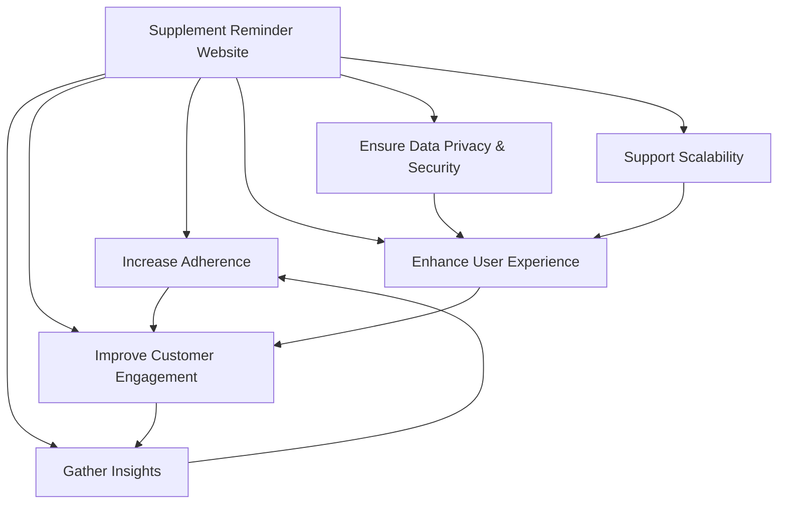

## 1.2 SCOPE

The supplement reminder website is a web-based application designed to help consumers remember to take their supplements through timely text message reminders. The system is primarily targeted at users aged 21-35, with a focus on women.

### Goals

1. Provide a simple, mobile-friendly interface for users to set up reminders quickly.
2. Deliver reliable and timely text message reminders to users.
3. Collect and analyze user engagement data to improve the product and service.
4. Ensure the security and privacy of user information.

### Benefits

1. Improved supplement effectiveness through consistent usage.
2. Enhanced customer satisfaction and loyalty.
3. Increased brand engagement and potential for repeat purchases.
4. Valuable insights into customer behavior and preferences.

### Core Functionalities

| Functionality | Description |
|---------------|-------------|
| QR Code Access | Users can access the website by scanning a QR code on the product packaging. |
| User Input Form | A simple form collects user phone numbers and preferred reminder times. |
| Reminder Scheduling | The system schedules automated text message reminders based on user preferences. |
| SMS Delivery | Personalized reminder messages are sent to users at scheduled times. |
| Data Storage | User information and reminder preferences are securely stored and managed. |
| Basic Analytics | The system tracks user engagement and general location data for analysis. |
| User Confirmation | Immediate feedback is provided to users upon successful reminder setup. |

The scope of the project includes the development of a responsive web application, integration with a third-party SMS service, implementation of a secure database system, and basic analytics functionality. The project will be developed using Node.js with Express.js framework for the backend, PostgreSQL for the database, and a responsive front-end design optimized for mobile devices.

The system will be designed to handle the initial target audience with the potential for scalability to accommodate future growth and possible feature expansions. The project timeline aims for completion within a 5-month period, following a phased development approach to ensure a robust and user-friendly final product.

Certainly. I'll break down the product into features, maintaining consistency with the previously mentioned technology and framework choices. For each feature, I'll include the requested sub-sections.

## 2. TECHNICAL REQUIREMENTS

### 2.1 QR Code Redirection

#### ID
TR-001

#### DESCRIPTION
The system shall redirect users to the reminder setup page when they scan the QR code printed on the product packaging.

#### PRIORITY
High

#### TABLE OF TECHNICAL REQUIREMENTS

| Requirement ID | Requirement Description |
|----------------|--------------------------|
| TR-001-1 | Implement a Node.js server with Express.js to handle QR code redirection requests. |
| TR-001-2 | Use a URL shortening service or custom short URL to optimize QR code density. |
| TR-001-3 | Ensure the redirection works across major mobile operating systems (iOS, Android) and browsers. |
| TR-001-4 | Implement analytics tracking for QR code scans using Google Analytics or a similar service. |

### 2.2 User Input Form

#### ID
TR-002

#### DESCRIPTION
The system shall provide a web form to collect user phone numbers and preferred reminder times.

#### PRIORITY
High

#### TABLE OF TECHNICAL REQUIREMENTS

| Requirement ID | Requirement Description |
|----------------|--------------------------|
| TR-002-1 | Develop a responsive HTML5 form using CSS3 for styling, adhering to the specified color scheme. |
| TR-002-2 | Implement client-side form validation using JavaScript to check phone number format and required fields. |
| TR-002-3 | Use a JavaScript time picker library compatible with mobile devices for reminder time selection. |
| TR-002-4 | Implement server-side validation in Node.js to double-check user inputs before processing. |

### 2.3 Reminder Scheduling

#### ID
TR-003

#### DESCRIPTION
The system shall schedule automated text message reminders based on user-specified times.

#### PRIORITY
High

#### TABLE OF TECHNICAL REQUIREMENTS

| Requirement ID | Requirement Description |
|----------------|--------------------------|
| TR-003-1 | Develop a scheduling service using Node.js and a job scheduling library (e.g., node-cron). |
| TR-003-2 | Integrate with a third-party SMS service API (e.g., Twilio or SendGrid) for sending reminders. |
| TR-003-3 | Implement a PostgreSQL database to store user reminder preferences and scheduling information. |
| TR-003-4 | Develop a mechanism to handle time zone conversions to ensure accurate reminder delivery. |

### 2.4 Data Storage and Management

#### ID
TR-004

#### DESCRIPTION
The system shall securely store and manage user information and reminder preferences.

#### PRIORITY
High

#### TABLE OF TECHNICAL REQUIREMENTS

| Requirement ID | Requirement Description |
|----------------|--------------------------|
| TR-004-1 | Set up a PostgreSQL database with appropriate tables for user data and reminder schedules. |
| TR-004-2 | Implement data encryption for sensitive information (e.g., phone numbers) using industry-standard encryption libraries. |
| TR-004-3 | Develop database access layers using an ORM (e.g., Sequelize) for Node.js. |
| TR-004-4 | Implement proper database indexing and query optimization for efficient data retrieval. |

### 2.5 SMS Delivery

#### ID
TR-005

#### DESCRIPTION
The system shall send personalized reminder messages to users at scheduled times.

#### PRIORITY
High

#### TABLE OF TECHNICAL REQUIREMENTS

| Requirement ID | Requirement Description |
|----------------|--------------------------|
| TR-005-1 | Integrate with a chosen SMS gateway API (e.g., Twilio) using their Node.js SDK. |
| TR-005-2 | Implement error handling and logging for SMS delivery failures. |
| TR-005-3 | Develop a retry mechanism for failed SMS deliveries with a maximum of 3 attempts. |
| TR-005-4 | Implement rate limiting to prevent abuse of the SMS service. |

### 2.6 Analytics and Reporting

#### ID
TR-006

#### DESCRIPTION
The system shall track user engagement and provide basic analytics capabilities.

#### PRIORITY
Medium

#### TABLE OF TECHNICAL REQUIREMENTS

| Requirement ID | Requirement Description |
|----------------|--------------------------|
| TR-006-1 | Integrate Google Analytics or a similar service for web traffic analysis. |
| TR-006-2 | Implement custom event tracking for key user actions (e.g., form submissions, reminder setups). |
| TR-006-3 | Develop a basic reporting module using Node.js to generate usage statistics from the database. |
| TR-006-4 | Create a simple dashboard for viewing analytics data, using a JavaScript charting library (e.g., Chart.js). |

### 2.7 Security and Compliance

#### ID
TR-007

#### DESCRIPTION
The system shall implement security best practices and comply with relevant data protection regulations.

#### PRIORITY
High

#### TABLE OF TECHNICAL REQUIREMENTS

| Requirement ID | Requirement Description |
|----------------|--------------------------|
| TR-007-1 | Implement HTTPS using TLS 1.3 or higher for all client-server communications. |
| TR-007-2 | Use secure HTTP headers, including Content Security Policy and X-XSS-Protection. |
| TR-007-3 | Implement input validation and sanitization to prevent SQL injection and XSS attacks. |
| TR-007-4 | Ensure compliance with GDPR, CCPA, and TCPA regulations in data handling and user communications. |

### 2.8 Performance Optimization

#### ID
TR-008

#### DESCRIPTION
The system shall be optimized for fast loading and response times, especially on mobile devices.

#### PRIORITY
Medium

#### TABLE OF TECHNICAL REQUIREMENTS

| Requirement ID | Requirement Description |
|----------------|--------------------------|
| TR-008-1 | Implement server-side caching using Redis to reduce database load. |
| TR-008-2 | Optimize front-end assets using minification and compression techniques. |
| TR-008-3 | Implement lazy loading for non-critical resources to improve initial page load times. |
| TR-008-4 | Use a content delivery network (CDN) for serving static assets to reduce latency. |

These technical requirements maintain consistency with the previously mentioned technology choices, including Node.js with Express.js for the backend, PostgreSQL for the database, and a focus on mobile optimization and responsive design. The features cover the core functionalities of the supplement reminder website while addressing important aspects such as security, performance, and compliance.

Certainly! Here's the SYSTEM ARCHITECTURE section for the Technical Specifications document, including a high-level system architecture diagram using MermaidJS. This section maintains consistency with the previously mentioned technology and framework choices.

# 3. SYSTEM ARCHITECTURE

## 3.1 Overview

The supplement reminder website is designed as a modern web application with a client-server architecture. It utilizes a responsive front-end, a Node.js backend with Express.js framework, and a PostgreSQL database for data persistence. The system integrates with third-party services for SMS delivery and analytics.

## 3.2 High-Level Architecture Diagram

The following diagram provides an overview of the system's components and their interactions:

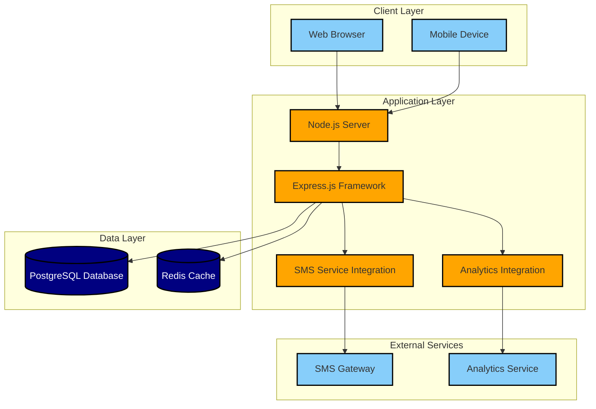

## 3.3 Component Description

### 3.3.1 Client Layer

- **Web Browser**: Supports desktop and mobile browsers, providing a responsive interface for users to access the reminder setup page.
- **Mobile Device**: Primary method of access for users, supporting QR code scanning and mobile-optimized web views.

### 3.3.2 Application Layer

- **Node.js Server**: Hosts the backend application, handling HTTP requests and business logic.
- **Express.js Framework**: Provides routing, middleware support, and API endpoints for the application.
- **SMS Service Integration**: Manages the integration with the third-party SMS gateway for sending reminders.
- **Analytics Integration**: Handles the collection and transmission of user engagement data to the analytics service.

### 3.3.3 Data Layer

- **PostgreSQL Database**: Stores user information, reminder schedules, and other persistent data.
- **Redis Cache**: Provides in-memory caching for frequently accessed data to improve performance.

### 3.3.4 External Services

- **SMS Gateway**: Third-party service (e.g., Twilio or SendGrid) for sending SMS reminders to users.
- **Analytics Service**: External platform (e.g., Google Analytics) for tracking and analyzing user behavior.

## 3.4 Data Flow

The following diagram illustrates the main data flow within the system:

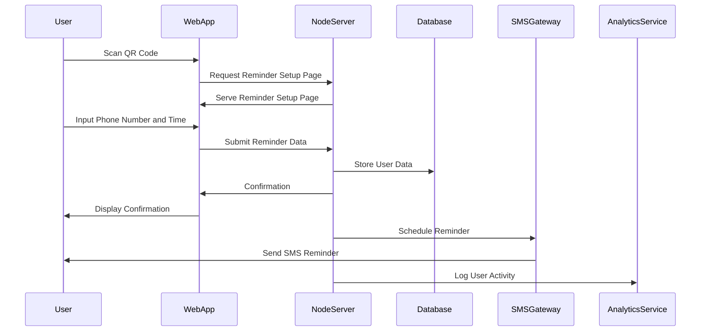

## 3.5 Technology Stack

- **Frontend**: HTML5, CSS3, JavaScript (ES6+)
- **Backend**: Node.js with Express.js framework
- **Database**: PostgreSQL
- **Caching**: Redis
- **SMS Service**: Twilio or SendGrid
- **Analytics**: Google Analytics
- **Deployment**: Docker containers on a cloud platform (e.g., AWS, Google Cloud, or Azure)

## 3.6 Security Considerations

- HTTPS encryption for all client-server communications
- Input validation and sanitization to prevent XSS and SQL injection attacks
- Rate limiting to prevent abuse of the SMS service
- Encryption of sensitive data at rest (e.g., phone numbers) using AES-256
- Implementation of secure HTTP headers (e.g., Content Security Policy)
- Regular security audits and penetration testing

## 3.7 Scalability and Performance

- Horizontal scaling of Node.js servers behind a load balancer
- Database replication and sharding for increased capacity
- Caching frequently accessed data in Redis to reduce database load
- Content Delivery Network (CDN) for serving static assets
- Asynchronous processing of non-critical tasks (e.g., analytics data collection)

## 3.8 Monitoring and Logging

- Implementation of centralized logging system (e.g., ELK stack)
- Real-time monitoring of system health and performance metrics
- Automated alerts for critical errors and performance issues
- Regular review of analytics data for user engagement insights

This SYSTEM ARCHITECTURE section provides a comprehensive overview of the supplement reminder website's architecture, maintaining consistency with the previously mentioned technology choices and requirements. The high-level diagram and data flow illustration offer visual representations of the system's components and their interactions, facilitating a clear understanding of the overall architecture.

Certainly! I'll create a SYSTEM COMPONENTS section for the Technical Specifications document, including the requested subsections. I'll use Mermaid JS diagrams and markdown tables to illustrate the information clearly while maintaining consistency with the previously mentioned technology and framework choices.

# 4. SYSTEM COMPONENTS

## 4.1 COMPONENT DIAGRAMS

The following diagram illustrates the main components of the supplement reminder system and their relationships:

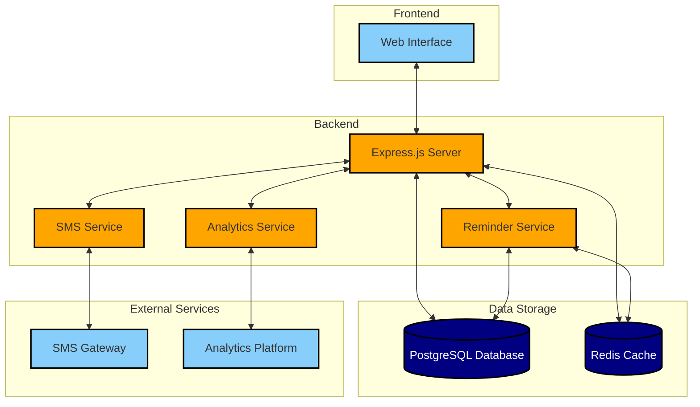

### Component Descriptions

| Component | Description |
|-----------|-------------|
| Web Interface | Responsive frontend built with HTML5, CSS3, and JavaScript |
| Express.js Server | Node.js server handling HTTP requests and application logic |
| Reminder Service | Module responsible for scheduling and managing reminders |
| SMS Service | Component interfacing with the external SMS gateway |
| Analytics Service | Module collecting and processing user engagement data |
| PostgreSQL Database | Primary data storage for user information and reminders |
| Redis Cache | In-memory cache for frequently accessed data |
| SMS Gateway | External service (e.g., Twilio) for sending SMS messages |
| Analytics Platform | External service (e.g., Google Analytics) for data analysis |

## 4.2 SEQUENCE DIAGRAMS

### 4.2.1 User Registration and Reminder Setup

The following sequence diagram illustrates the process of a user registering and setting up a reminder:

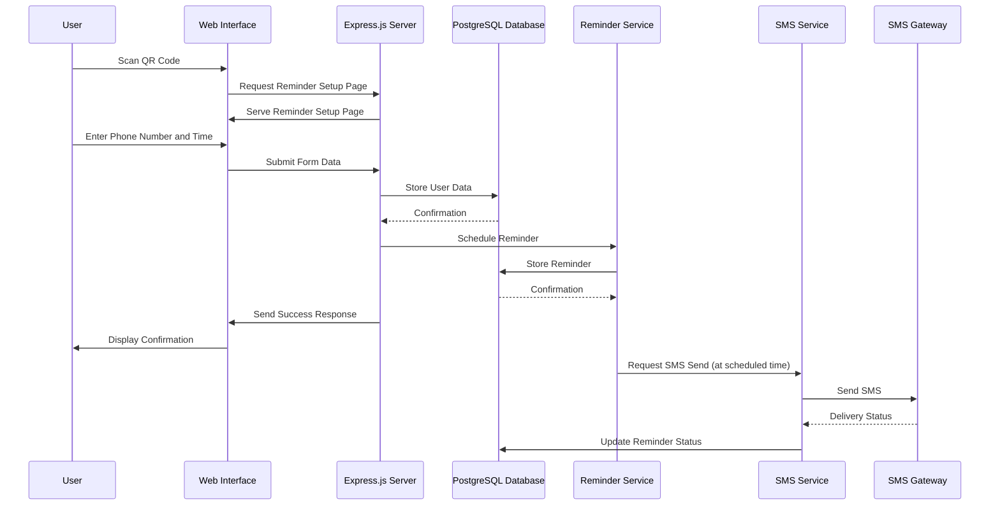

### 4.2.2 Analytics Data Collection

This sequence diagram shows the process of collecting and storing analytics data:

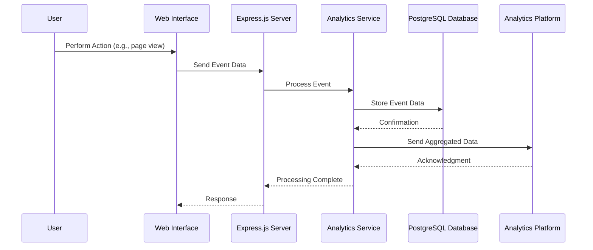

## 4.3 DATA-FLOW DIAGRAM

The following data-flow diagram illustrates how information moves through the supplement reminder system:

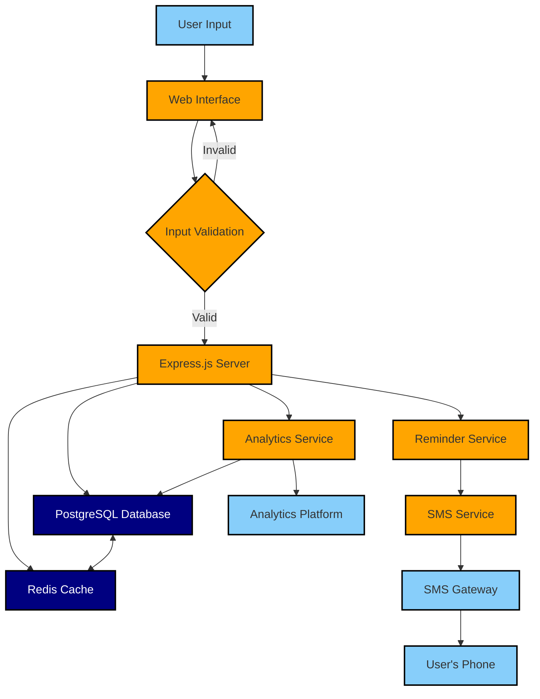

### Data Flow Description

1. User input is collected through the web interface.
2. Input is validated on both client and server sides.
3. Valid data is processed by the Express.js server.
4. User information and reminder settings are stored in the PostgreSQL database.
5. Frequently accessed data is cached in Redis for improved performance.
6. The Reminder Service manages scheduled reminders.
7. When a reminder is due, the SMS Service sends a request to the SMS Gateway.
8. The SMS Gateway delivers the reminder message to the user's phone.
9. User interactions and system events are processed by the Analytics Service.
10. Aggregated analytics data is sent to the external Analytics Platform for further analysis.
11. The Analytics Service also stores relevant data in the PostgreSQL database for internal use.

This SYSTEM COMPONENTS section provides a comprehensive overview of the supplement reminder website's architecture, component interactions, and data flow. The diagrams and descriptions maintain consistency with the previously mentioned technology choices, including Node.js with Express.js for the backend, PostgreSQL for the database, Redis for caching, and the integration with external services for SMS delivery and analytics.

# 5. SYSTEM DESIGN

## 5.1 PROGRAMMING LANGUAGES

The following programming languages have been selected for the supplement reminder website project, based on the requirements and previously mentioned technology choices:

| Language | Platform/Purpose | Justification |
|----------|------------------|---------------|
| JavaScript (ES6+) | Frontend | - Widely supported by modern browsers<br>- Rich ecosystem of libraries and frameworks<br>- Enables dynamic and interactive user interfaces |
| Node.js | Backend | - JavaScript runtime for server-side development<br>- Excellent performance for I/O-intensive operations<br>- Large ecosystem of packages via npm<br>- Consistent language usage across frontend and backend |
| HTML5 | Frontend | - Latest standard for structuring web content<br>- Provides semantic elements for improved accessibility<br>- Native support for multimedia and graphics |
| CSS3 | Frontend | - Latest standard for styling web content<br>- Supports responsive design through media queries<br>- Enables advanced layouts with Flexbox and Grid |
| SQL | Database Queries | - Standard language for relational database operations<br>- Powerful querying capabilities for complex data relationships<br>- Widely supported by PostgreSQL |

## 5.2 DATABASE DESIGN

The supplement reminder website will use PostgreSQL as the relational database management system. The following diagram illustrates the database schema:

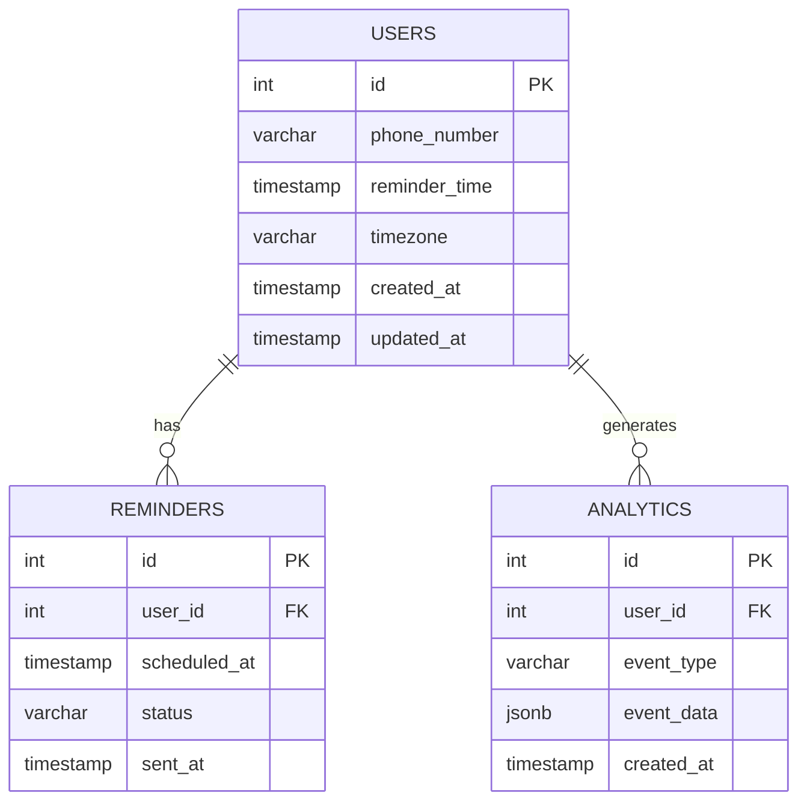

### Table Descriptions:

1. USERS
   - Stores essential user information
   - `id`: Unique identifier for each user
   - `phone_number`: User's phone number (encrypted at rest)
   - `reminder_time`: User's preferred reminder time
   - `timezone`: User's timezone for accurate reminder scheduling
   - `created_at` and `updated_at`: Timestamps for record keeping

2. REMINDERS
   - Tracks individual reminders scheduled for users
   - `id`: Unique identifier for each reminder
   - `user_id`: Foreign key referencing the USERS table
   - `scheduled_at`: Timestamp for when the reminder is scheduled
   - `status`: Current status of the reminder (e.g., pending, sent, failed)
   - `sent_at`: Timestamp for when the reminder was actually sent

3. ANALYTICS
   - Captures user engagement and system events for analysis
   - `id`: Unique identifier for each analytics event
   - `user_id`: Foreign key referencing the USERS table
   - `event_type`: Type of event (e.g., registration, reminder_set, reminder_sent)
   - `event_data`: JSON object containing additional event details
   - `created_at`: Timestamp for when the event occurred

## 5.3 API DESIGN

The supplement reminder website will use a RESTful API design for communication between the frontend, backend, and external systems. The API will be implemented using Express.js on the Node.js backend.

### API Endpoints:

```mermaid
graph TD
    A[API Root /api/v1] --> B[/users]
    A --> C[/reminders]
    A --> D[/analytics]
    B --> B1[POST /register]
    B --> B2[PUT /update]
    B --> B3[DELETE /unsubscribe]
    C --> C1[GET /status]
    C --> C2[POST /create]
    C --> C3[PUT /update]
    D --> D1[POST /event]
    D --> D2[GET /summary]
```

### Detailed API Specifications:

1. User Management
   - `POST /api/v1/users/register`
     - Purpose: Register a new user
     - Request Body: `{ "phone_number": string, "reminder_time": string, "timezone": string }`
     - Response: `{ "user_id": int, "message": string }`

   - `PUT /api/v1/users/update`
     - Purpose: Update user information
     - Request Body: `{ "user_id": int, "reminder_time": string, "timezone": string }`
     - Response: `{ "message": string }`

   - `DELETE /api/v1/users/unsubscribe`
     - Purpose: Unsubscribe a user from reminders
     - Request Body: `{ "user_id": int }`
     - Response: `{ "message": string }`

2. Reminder Management
   - `GET /api/v1/reminders/status`
     - Purpose: Get reminder status for a user
     - Query Parameters: `user_id`
     - Response: `{ "reminders": [{ "id": int, "scheduled_at": string, "status": string }] }`

   - `POST /api/v1/reminders/create`
     - Purpose: Create a new reminder
     - Request Body: `{ "user_id": int, "scheduled_at": string }`
     - Response: `{ "reminder_id": int, "message": string }`

   - `PUT /api/v1/reminders/update`
     - Purpose: Update an existing reminder
     - Request Body: `{ "reminder_id": int, "scheduled_at": string }`
     - Response: `{ "message": string }`

3. Analytics
   - `POST /api/v1/analytics/event`
     - Purpose: Log an analytics event
     - Request Body: `{ "user_id": int, "event_type": string, "event_data": object }`
     - Response: `{ "message": string }`

   - `GET /api/v1/analytics/summary`
     - Purpose: Get summary of analytics data
     - Query Parameters: `start_date`, `end_date`
     - Response: `{ "total_users": int, "active_reminders": int, "reminder_sent_count": int }`

### API Security Measures:

1. Authentication: Implement JWT (JSON Web Tokens) for API authentication
2. Rate Limiting: Apply rate limiting to prevent abuse of the API
3. Input Validation: Validate and sanitize all input data to prevent injection attacks
4. HTTPS: Ensure all API communications are encrypted using HTTPS
5. CORS: Implement proper Cross-Origin Resource Sharing policies

This API design provides a comprehensive interface for managing users, reminders, and analytics data, while maintaining consistency with the previously mentioned technology choices and requirements.

# 6. USER INTERFACE DESIGN

The user interface for the supplement reminder website is designed to be simple, intuitive, and mobile-friendly, adhering to the specified color scheme of orange, navy blue, and baby blue. The design focuses on providing a seamless experience for users aged 21-35, with a particular emphasis on women.

## 6.1 General Design Principles

- Responsive design: The interface adapts to various screen sizes, from mobile devices to desktop computers.
- Minimalist approach: Clean, uncluttered layouts with clear call-to-action elements.
- Accessibility: WCAG 2.1 Level AA compliant, ensuring usability for users with disabilities.
- Consistent branding: Use of the specified color scheme throughout the interface.
- Mobile-first: Optimized for mobile devices, as most users will access the site via QR code scanning.

## 6.2 Color Scheme

- Primary Color (Orange): #FFA500
- Secondary Color (Navy Blue): #000080
- Tertiary Color (Baby Blue): #89CFF0
- Background Color: #FFFFFF
- Text Color: #333333
- Error Color: #FF0000

## 6.3 Typography

- Primary Font: Arial, sans-serif
- Secondary Font: Georgia, serif
- Font Sizes:
  - Headings: 24px - 36px
  - Body Text: 16px - 18px
  - Button Text: 18px
  - Form Labels: 14px

## 6.4 Landing Page

The landing page is the first screen users see after scanning the QR code on the product packaging.

```
+----------------------------------+
|        [Logo] Supplement         |
|           Reminder               |
+----------------------------------+
|                                  |
|  Welcome to Supplement Reminder! |
|  Set up your daily reminder now. |
|                                  |
| +------------------------------+ |
| |  Phone Number:               | |
| |  [________________]          | |
| +------------------------------+ |
|                                  |
| +------------------------------+ |
| |  Reminder Time:              | |
| |  [12:00 AM  v]               | |
| +------------------------------+ |
|                                  |
| [      Set Reminder      ]       |
|                                  |
| Need help? Check our FAQ         |
+----------------------------------+
| Privacy Policy | Terms of Service|
+----------------------------------+
```

### Functionality:
- Logo and title are prominently displayed at the top.
- Brief welcome message explains the purpose of the service.
- Phone number input field with validation for correct format.
- Time picker defaulted to 12:00 AM, allowing users to adjust as needed.
- Large, prominent "Set Reminder" button in the primary color.
- Link to FAQ section for additional information.
- Footer with links to Privacy Policy and Terms of Service.

## 6.5 Confirmation Page

This page is displayed after successful submission of the reminder form.

```
+----------------------------------+
|        [Logo] Supplement         |
|           Reminder               |
+----------------------------------+
|                                  |
|        Reminder Set!             |
|                                  |
|  We'll remind you to take your   |
|  supplement at:                  |
|                                  |
|        [08:00 AM]                |
|                                  |
|  Phone Number: (XXX) XXX-1234    |
|                                  |
| [    Modify Reminder    ]        |
|                                  |
| [    Cancel Reminder    ]        |
|                                  |
|  What's next?                    |
|  - Look out for our text         |
|  - Take your supplement daily    |
|  - Stay healthy!                 |
+----------------------------------+
| Privacy Policy | Terms of Service|
+----------------------------------+
```

### Functionality:
- Clear confirmation message at the top.
- Display of the set reminder time and masked phone number.
- Options to modify or cancel the reminder.
- Brief instructions on what to expect next.
- Consistent footer with privacy and terms links.

## 6.6 Error Handling

Error messages are displayed inline with form fields and use the error color for visibility.

```
+----------------------------------+
|        [Logo] Supplement         |
|           Reminder               |
+----------------------------------+
|                                  |
| +------------------------------+ |
| |  Phone Number:               | |
| |  [________________]          | |
| |  Please enter a valid phone  | |
| |  number.                     | |
| +------------------------------+ |
|                                  |
| +------------------------------+ |
| |  Reminder Time:              | |
| |  [        v]                 | |
| |  Please select a time.       | |
| +------------------------------+ |
|                                  |
| [      Set Reminder      ]       |
+----------------------------------+
```

### Functionality:
- Error messages appear directly below the relevant input field.
- The error text is displayed in the designated error color (#FF0000).
- Form fields with errors are highlighted with a red border.
- The "Set Reminder" button remains clickable to allow resubmission after corrections.

## 6.7 Mobile Responsiveness

The design adapts to smaller screen sizes by adjusting layout and font sizes.

```
+----------------------+
|    [Logo]            |
| Supplement Reminder  |
+----------------------+
|                      |
| Welcome! Set up your |
| daily reminder.      |
|                      |
| Phone Number:        |
| [________________]   |
|                      |
| Reminder Time:       |
| [12:00 AM  v]        |
|                      |
| [  Set Reminder   ]  |
|                      |
| Need help? FAQ       |
+----------------------+
| Privacy | Terms      |
+----------------------+
```

### Functionality:
- Single-column layout for mobile devices.
- Larger touch targets for better usability on small screens.
- Simplified footer to conserve vertical space.
- Full-width input fields and buttons for easier interaction.

## 6.8 Accessibility Features

- High contrast between text and background colors.
- Alt text for all images and icons.
- Proper heading structure (H1, H2, etc.) for screen readers.
- Keyboard navigation support for all interactive elements.
- ARIA labels and roles where appropriate.
- Focus indicators for keyboard users.

## 6.9 Loading States

```
+----------------------------------+
|        [Logo] Supplement         |
|           Reminder               |
+----------------------------------+
|                                  |
|          [Spinner Icon]          |
|                                  |
|        Setting your reminder...  |
|                                  |
|        Please wait.              |
|                                  |
+----------------------------------+
```

### Functionality:
- Displayed when submitting the form or performing any action that requires server communication.
- Spinner icon indicates ongoing process.
- Clear message informs the user about the current action.

These user interface designs maintain consistency with the previously mentioned technology choices, including the use of responsive design principles and mobile-first approach. The layouts are simple and focused, catering to the target audience of users aged 21-35, with a focus on women. The designs incorporate the specified color scheme and emphasize ease of use, particularly on mobile devices where users are most likely to interact with the website after scanning the QR code.

# 7. TECHNOLOGY STACK

## 7.1 PROGRAMMING LANGUAGES

The following programming languages have been selected for the supplement reminder website project:

| Language | Platform/Purpose | Justification |
|----------|------------------|---------------|
| JavaScript (ES6+) | Frontend & Backend | - Versatile language for both client-side and server-side development<br>- Large ecosystem and community support<br>- Excellent performance for asynchronous operations<br>- Consistent language usage across the entire stack |
| HTML5 | Frontend | - Latest standard for structuring web content<br>- Semantic elements improve accessibility and SEO<br>- Native support for multimedia and mobile-friendly features |
| CSS3 | Frontend | - Modern styling capabilities for responsive design<br>- Flexbox and Grid layouts for complex UI structures<br>- Supports animations and transitions for enhanced UX |
| SQL | Database Queries | - Standard language for relational database operations<br>- Powerful querying capabilities for complex data relationships<br>- Well-supported by PostgreSQL |

## 7.2 FRAMEWORKS AND LIBRARIES

The project will utilize the following frameworks and libraries:

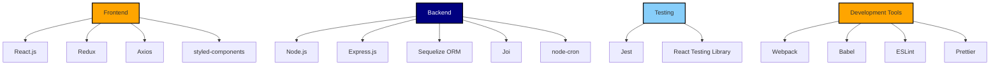

### Frontend
- React.js: A popular JavaScript library for building user interfaces
- Redux: State management library for predictable state updates
- Axios: Promise-based HTTP client for making API requests
- styled-components: CSS-in-JS library for component-based styling

### Backend
- Node.js: JavaScript runtime for server-side development
- Express.js: Web application framework for Node.js
- Sequelize ORM: Object-Relational Mapping library for database interactions
- Joi: Schema validation library for input validation
- node-cron: Task scheduler for Node.js

### Testing
- Jest: JavaScript testing framework
- React Testing Library: Testing utilities for React components

### Development Tools
- Webpack: Module bundler for JavaScript applications
- Babel: JavaScript compiler for using next-generation JavaScript features
- ESLint: Static code analysis tool for identifying problematic patterns
- Prettier: Code formatter for consistent code style

## 7.3 DATABASES

The supplement reminder website will use the following database systems:

| Database | Purpose | Justification |
|----------|---------|---------------|
| PostgreSQL | Primary data storage | - Robust relational database with excellent performance<br>- Strong support for complex queries and transactions<br>- ACID compliance ensures data integrity<br>- Scalable for future growth |
| Redis | Caching and session storage | - In-memory data structure store for fast read/write operations<br>- Supports various data structures (strings, hashes, lists)<br>- Ideal for caching frequently accessed data to reduce database load |

## 7.4 THIRD-PARTY SERVICES

The following external services and APIs will be integrated into the system:

| Service | Purpose | Justification |
|---------|---------|---------------|
| Twilio | SMS gateway | - Reliable SMS delivery service with global coverage<br>- Comprehensive API for sending and tracking messages<br>- Supports features like delivery receipts and scheduling |
| Google Analytics | Web analytics | - Industry-standard analytics platform<br>- Provides detailed insights into user behavior and engagement<br>- Customizable tracking for specific events and goals |
| Amazon S3 | Static asset storage | - Scalable and cost-effective cloud storage solution<br>- High availability and durability for storing images and other static files<br>- Can be used with a CDN for improved content delivery |
| Stripe | Payment processing (if needed) | - Secure and widely adopted payment gateway<br>- Supports various payment methods and currencies<br>- Comprehensive API and SDK for easy integration |
| SendGrid | Transactional email service | - Reliable email delivery for system notifications and user communications<br>- Provides templates and analytics for email campaigns<br>- Can be used as a backup for SMS notifications |

This technology stack has been carefully selected to meet the requirements of the supplement reminder website project, ensuring scalability, performance, and maintainability. The choices align with the previously mentioned technology and framework decisions, focusing on a JavaScript-based stack with Node.js and React.js as the primary technologies for backend and frontend development, respectively.

# 8. SECURITY CONSIDERATIONS

## 8.1 AUTHENTICATION AND AUTHORIZATION

The supplement reminder website primarily focuses on a single-use interaction where users input their phone numbers and preferred reminder times. However, to ensure the security of user data and prevent unauthorized access to the system, the following authentication and authorization measures will be implemented:

### 8.1.1 User Authentication

1. Phone Number Verification:
   - Upon initial submission of the phone number, a one-time verification code will be sent via SMS.
   - Users must enter this code to confirm their phone number before the reminder is set.

2. Reminder Modification:
   - To modify or cancel a reminder, users will need to authenticate using a unique link sent to their registered phone number.

### 8.1.2 Admin Authentication

For administrative access to the system:

1. Multi-factor Authentication (MFA):
   - Username and password
   - Time-based One-Time Password (TOTP) using an authenticator app

2. Session Management:
   - JWT (JSON Web Tokens) for maintaining authenticated sessions
   - Token expiration set to 1 hour for enhanced security

### 8.1.3 Authorization Levels

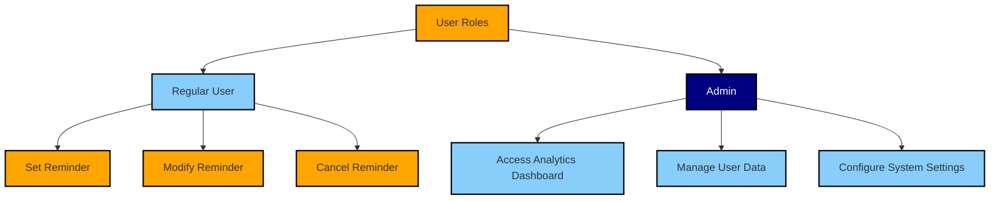

## 8.2 DATA SECURITY

To protect sensitive user information and maintain the integrity of the system, the following data security measures will be implemented:

### 8.2.1 Data Encryption

| Data Type | Encryption Method | Key Management |
|-----------|-------------------|----------------|
| Phone Numbers | AES-256 (at rest) | Hardware Security Module (HSM) |
| User Input | TLS 1.3 (in transit) | Managed by web server |
| Database Backups | AES-256 | Separate key management system |

### 8.2.2 Data Access Control

1. Principle of Least Privilege:
   - Database access restricted to application service accounts
   - Admin access limited to specific IP ranges

2. Database Security:
   - Use of prepared statements to prevent SQL injection
   - Regular security patching and updates

3. API Security:
   - Implementation of API keys for external service integrations
   - Rate limiting to prevent abuse

### 8.2.3 Data Retention and Disposal

1. Retention Policy:
   - User data retained for 6 months after last activity
   - Reminder data kept for 3 months after scheduled time

2. Secure Disposal:
   - Use of secure deletion methods (e.g., multiple overwrites)
   - Regular audits of disposed data

## 8.3 SECURITY PROTOCOLS

The following security protocols will be implemented to maintain the overall security of the system:

### 8.3.1 Network Security

1. Firewall Configuration:
   - Restrict inbound traffic to essential ports (80, 443)
   - Implement Web Application Firewall (WAF) for additional protection

2. HTTPS Implementation:
   - Enforce HTTPS across all pages
   - Use of HSTS (HTTP Strict Transport Security) headers

3. DDoS Protection:
   - Utilize cloud-based DDoS mitigation services

### 8.3.2 Application Security

1. Input Validation:
   - Server-side validation of all user inputs
   - Implementation of Content Security Policy (CSP) headers

2. Dependency Management:
   - Regular updates of Node.js and npm packages
   - Use of automated tools (e.g., npm audit) for vulnerability scanning

3. Error Handling:
   - Custom error pages to prevent information leakage
   - Logging of errors without exposing sensitive information

### 8.3.3 Monitoring and Incident Response

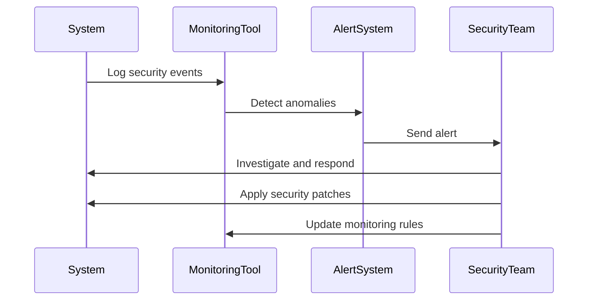

1. Continuous Monitoring:
   - Implementation of intrusion detection systems (IDS)
   - Real-time monitoring of system logs and user activities

2. Incident Response Plan:
   - Clearly defined roles and responsibilities
   - Regular drills and updates to the response plan

3. Security Audits:
   - Quarterly internal security audits
   - Annual third-party penetration testing

### 8.3.4 Compliance

1. GDPR Compliance:
   - Implementation of data subject rights (e.g., right to erasure)
   - Maintenance of data processing records

2. CCPA Compliance:
   - Clear disclosure of data collection practices
   - Mechanism for users to opt-out of data sharing

3. TCPA Compliance:
   - Obtain explicit consent for SMS reminders
   - Provide clear instructions for opting out of reminders

These security considerations align with the previously mentioned technology choices, including the use of Node.js with Express.js for the backend, PostgreSQL for the database, and integration with third-party SMS services. The measures outlined here aim to protect user data, maintain system integrity, and ensure compliance with relevant regulations while providing a secure and reliable supplement reminder service.

# 9. INFRASTRUCTURE

## 9.1 DEPLOYMENT ENVIRONMENT

The supplement reminder website will be deployed using a cloud-based infrastructure to ensure scalability, reliability, and ease of management. This approach aligns with the project's requirements for quick loading times, mobile optimization, and the ability to handle potential spikes in user registrations.

| Environment | Description | Purpose |
|-------------|-------------|---------|
| Development | Local development machines | Code development and initial testing |
| Staging | Cloud-based environment mirroring production | Integration testing and final QA |
| Production | Cloud-based environment | Live application serving end-users |

## 9.2 CLOUD SERVICES

We will utilize Amazon Web Services (AWS) as our cloud service provider due to its robust offerings, scalability, and extensive experience in hosting web applications. The following AWS services will be used:

| Service | Purpose | Justification |
|---------|---------|---------------|
| Amazon EC2 | Host the Node.js application servers | Scalable compute capacity in the cloud |
| Amazon RDS for PostgreSQL | Host the PostgreSQL database | Managed relational database service with easy scaling and backups |
| Amazon S3 | Store static assets and backups | Highly durable and scalable object storage |
| Amazon CloudFront | Content Delivery Network (CDN) | Improve loading times for static assets globally |
| Amazon Route 53 | DNS management | Reliable and cost-effective domain management |
| AWS Elastic Load Balancing | Distribute incoming traffic | Ensure high availability and fault tolerance |
| Amazon ElastiCache for Redis | Caching layer | Improve performance by caching frequent database queries |

## 9.3 CONTAINERIZATION

The application will be containerized using Docker to ensure consistency across development, staging, and production environments. This approach allows for easier scaling and management of the application components.

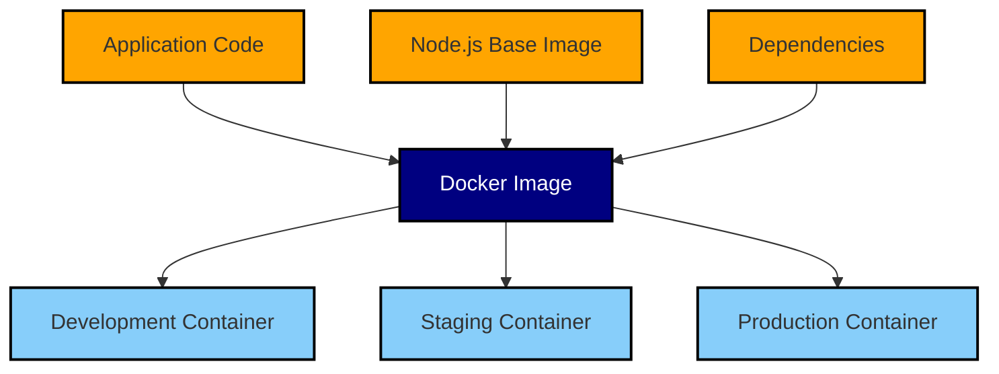

Key containerization components:

1. Dockerfile: Defines the application environment, including Node.js version and dependencies.
2. Docker Compose: Used for local development to orchestrate the application, database, and cache containers.
3. Container Registry: AWS Elastic Container Registry (ECR) will be used to store and manage Docker images.

## 9.4 ORCHESTRATION

For container orchestration in the production environment, we will use Amazon Elastic Container Service (ECS) with Fargate launch type. This serverless approach aligns with our need for easy scaling and management without the overhead of managing the underlying infrastructure.

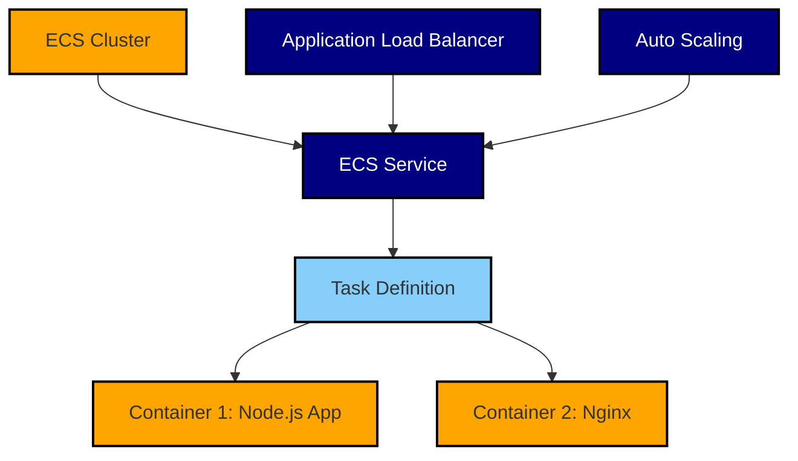

Key orchestration components:

1. ECS Cluster: Logical grouping of tasks or services.
2. ECS Service: Maintains and scales a specified number of instances of a task definition.
3. Task Definition: Specifies container images, CPU and memory requirements, and container linking.
4. Application Load Balancer: Distributes incoming application traffic across multiple targets.
5. Auto Scaling: Automatically adjusts the number of tasks based on specified metrics.

## 9.5 CI/CD PIPELINE

We will implement a robust CI/CD pipeline to automate the build, test, and deployment processes, ensuring rapid and reliable delivery of new features and bug fixes.

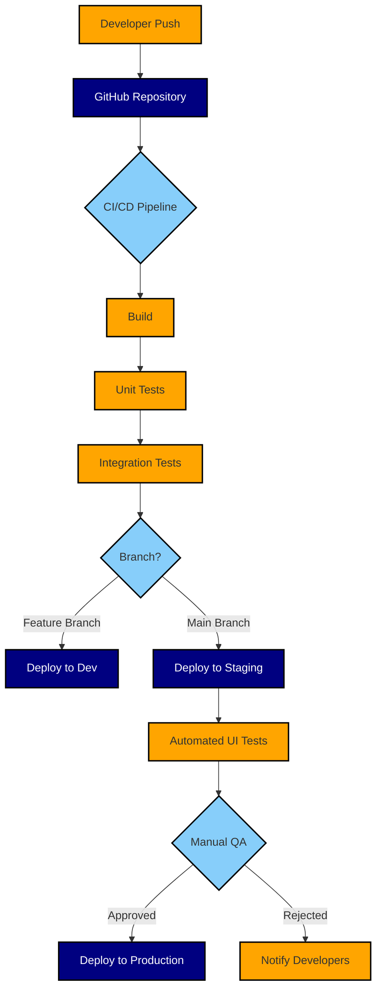

Key CI/CD components:

1. Version Control: GitHub for source code management and collaboration.
2. CI/CD Tool: AWS CodePipeline for orchestrating the pipeline stages.
3. Build Tool: AWS CodeBuild for compiling source code and running tests.
4. Deployment Tool: AWS CodeDeploy for automating application deployments to ECS.
5. Monitoring: AWS CloudWatch for monitoring application and infrastructure metrics.

Pipeline Stages:

1. Build: Compile code, install dependencies, and create Docker images.
2. Test: Run unit tests and integration tests.
3. Deploy to Development: Automatically deploy feature branches to the development environment.
4. Deploy to Staging: Deploy main branch changes to the staging environment.
5. Automated UI Tests: Run end-to-end tests on the staging environment.
6. Manual QA: Perform manual quality assurance checks.
7. Deploy to Production: Upon approval, deploy changes to the production environment.

This infrastructure setup ensures a scalable, reliable, and easily manageable deployment for the supplement reminder website. It aligns with the previously mentioned technology choices, including Node.js for the backend, PostgreSQL for the database, and the focus on mobile optimization and responsive design. The use of containerization and cloud services provides the flexibility to handle varying loads and potential future growth of the user base.

# APPENDICES

## A. ADDITIONAL TECHNICAL INFORMATION

### A.1 QR Code Generation

The QR code for the supplement reminder website should be generated using a reliable QR code generation library compatible with Node.js. Some recommended options include:

1. `qrcode` npm package
2. `qrcode-generator` npm package

The QR code should be generated with the following specifications:

- Error Correction Level: M (15% restoration capability)
- Size: Minimum 200x200 pixels for print
- Format: SVG for scalability in print materials

### A.2 SMS Character Limit

The reminder message "Bon voyage! Take the supplement so you feel better tomorrow!" is 65 characters long. This fits within the standard 160 character limit for a single SMS message, ensuring cost-effective delivery and compatibility with all mobile devices.

### A.3 Time Zone Handling

To ensure accurate reminder delivery across different time zones, the system should use a robust time zone library such as `moment-timezone`. This will help in:

1. Storing user's local time zone
2. Converting user's preferred reminder time to UTC for storage
3. Calculating the correct local time for sending reminders

### A.4 Database Indexing

To optimize query performance, the following indexes should be created in the PostgreSQL database:

```sql
CREATE INDEX idx_user_phone_number ON users(phone_number);
CREATE INDEX idx_reminder_scheduled_time ON reminders(scheduled_time);
CREATE INDEX idx_analytics_event_time ON analytics(event_time);
```

## B. GLOSSARY

| Term | Definition |
|------|------------|
| QR Code | Quick Response code, a type of matrix barcode that can be scanned by mobile devices to quickly access information or websites. |
| SMS | Short Message Service, a text messaging service component of most telephone, internet, and mobile device systems. |
| Responsive Design | A web design approach that creates dynamic changes to the appearance of a website, depending on the screen size and orientation of the device being used to view it. |
| API | Application Programming Interface, a set of protocols and tools for building software applications. |
| RDBMS | Relational Database Management System, a type of database management system that stores data in tables and allows for the establishment of relationships between these tables. |
| ORM | Object-Relational Mapping, a programming technique for converting data between incompatible type systems using object-oriented programming languages. |
| CDN | Content Delivery Network, a geographically distributed network of proxy servers and their data centers to provide high availability and performance by distributing the service spatially relative to end-users. |
| Containerization | A lightweight form of virtualization that involves encapsulating an application in a container with its own operating environment. |

## C. ACRONYMS

| Acronym | Expanded Form |
|---------|---------------|
| API | Application Programming Interface |
| AWS | Amazon Web Services |
| CCPA | California Consumer Privacy Act |
| CDN | Content Delivery Network |
| CI/CD | Continuous Integration/Continuous Deployment |
| CSS | Cascading Style Sheets |
| GDPR | General Data Protection Regulation |
| HTML | Hypertext Markup Language |
| HTTP | Hypertext Transfer Protocol |
| HTTPS | Hypertext Transfer Protocol Secure |
| JSON | JavaScript Object Notation |
| JWT | JSON Web Token |
| MFA | Multi-Factor Authentication |
| NPM | Node Package Manager |
| ORM | Object-Relational Mapping |
| QA | Quality Assurance |
| RDBMS | Relational Database Management System |
| REST | Representational State Transfer |
| SDK | Software Development Kit |
| SMS | Short Message Service |
| SQL | Structured Query Language |
| SSL | Secure Sockets Layer |
| TCPA | Telephone Consumer Protection Act |
| TLS | Transport Layer Security |
| URL | Uniform Resource Locator |
| UTC | Coordinated Universal Time |
| WAF | Web Application Firewall |
| WCAG | Web Content Accessibility Guidelines |
| XSS | Cross-Site Scripting |

This APPENDICES section provides additional technical details, a glossary of terms, and a list of acronyms used throughout the document. It maintains consistency with the previously mentioned technology choices, including Node.js, Express.js, PostgreSQL, and the focus on responsive design and mobile optimization.